# Sobrecarga

Sobrecarga e um app PWA para organizacao psicologica e acompanhamento pessoal em periodos de sobrecarga emocional, profissional ou familiar.

O objetivo nao e produtividade e nem gestao de tarefas.
O objetivo e dar clareza para o usuario revisar como esta, o que mudou e qual passo concreto merece atencao.

É possivel acessar o MVP via GitHub Pages por:

<p align="center">
  <a href="https://jimmykiedis.github.io/Sobrecarga/">
    
  </a>
  <br>
  <em>Clique na imagem para acessar a demonstração.</em>
</p>

Obs.: é necessário ter acesso cadastrado antecimpadamente pelo proprietário

## O que ja esta implementado

### Tela 1: Login

- Login com e-mail e senha.
- Integracao com Firebase Authentication.
- Tela responsiva com estado de carregamento e erro.

<table align="center">
  <tr>
    <td align="center">
      <br>
      <em>desktop view</em>
    </td>
    <td align="center">
      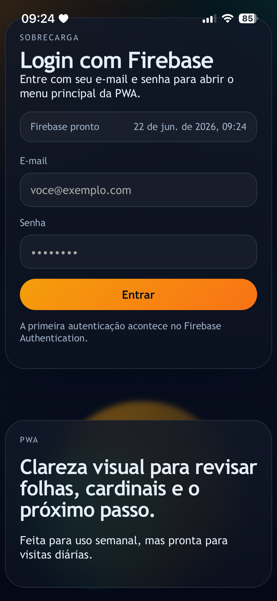<br>
      <em>mobile view</em>
    </td>
  </tr>
</table>

### Tela 2: Menu principal

O menu principal ja renderiza 11 cards:

1. Resumo simples com os dados mais relevante com gráfico.
<table align="center">
  <tr>
    <td align="center">
      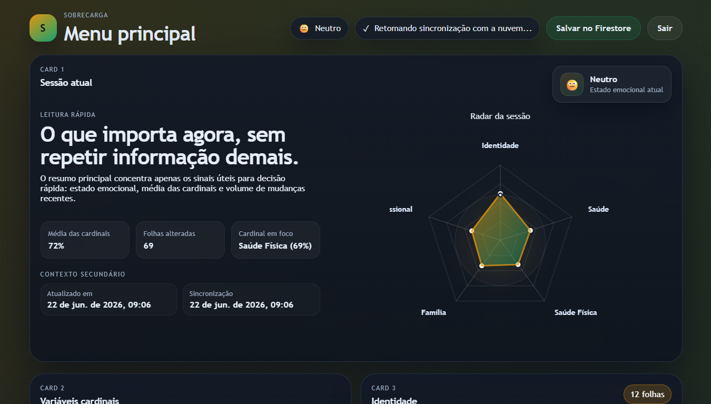<br>
      <em>desktop view</em>
    </td>
    <td align="center">
      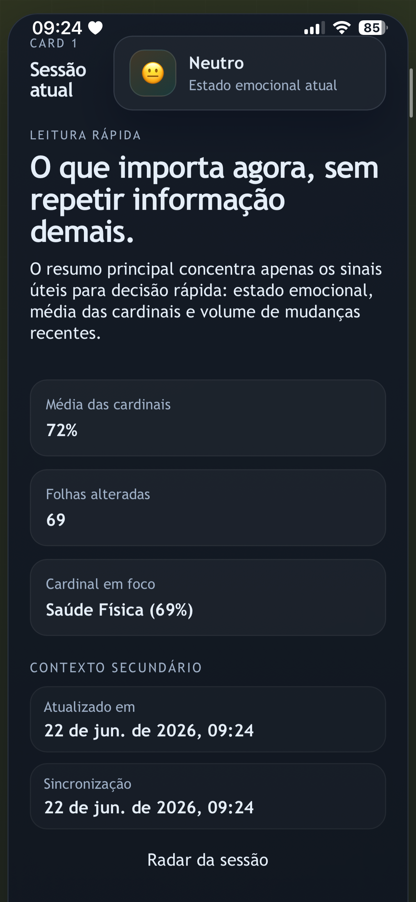<br>
      <em>mobile view</em>
    </td>
  </tr>
</table>

2. Variaveis cardinais referentes aos campo da vida do usuário com valores entre `49` e `99`.
<table align="center">
  <tr>
    <td align="center">
      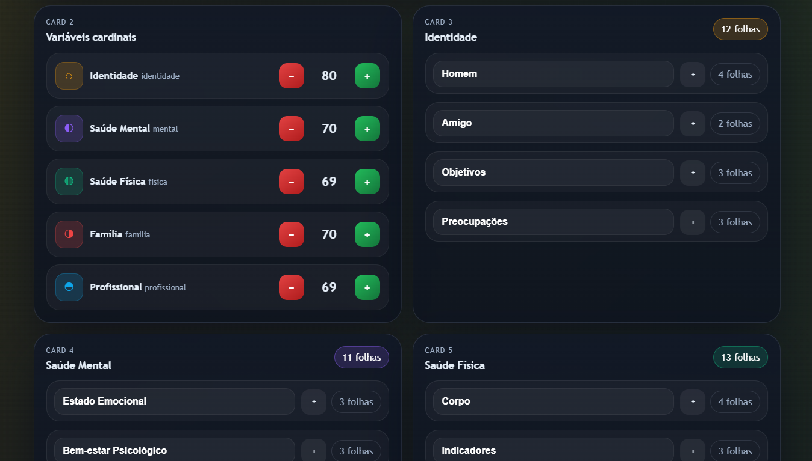<br>
      <em>desktop view</em>
    </td>
    <td align="center">
      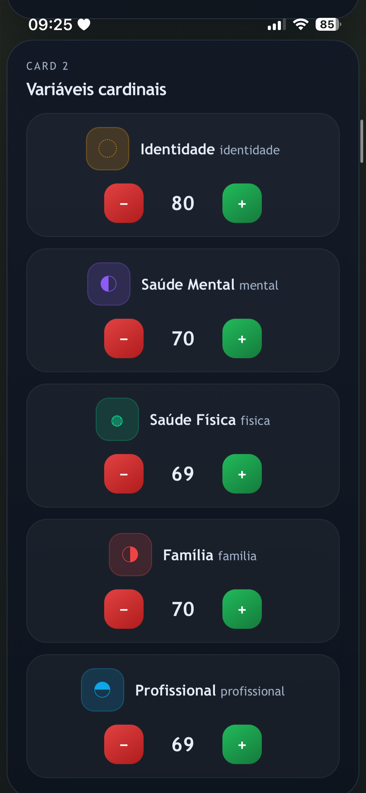<br>
      <em>mobile view</em>
    </td>
  </tr>
</table>

3. Card das Variáveis base ligadas à cardinal `Identidade`.
4. Card das Variáveis base ligadas à cardinal `Saude Mental`.
5. Card das Variáveis base ligadas à cardinal `Saude Fisica`.
6. Card das Variáveis base ligadas à cardinal `Familia`.
7. Card das Variáveis base ligadas à cardinal `Profissional`.
8. Pop-up que pergunta do progresso em um intervalo relativo em uma escala de `-3` a `+3`.
<table align="center">
  <tr>
    <td align="center">
      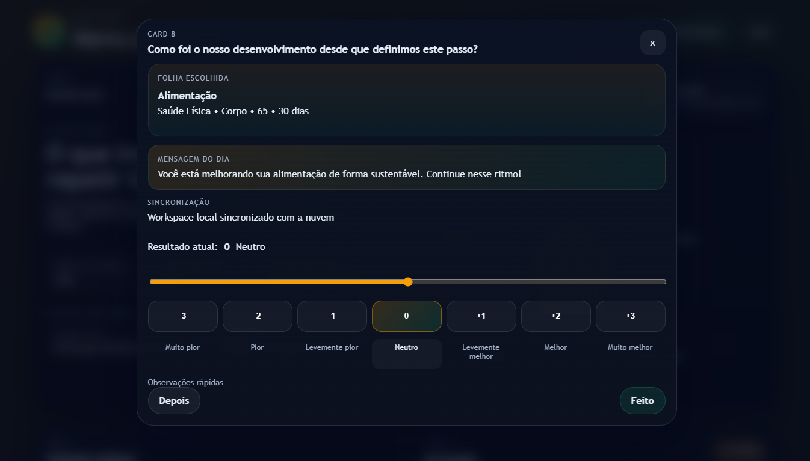<br>
      <em>desktop view</em>
    </td>
    <td align="center">
      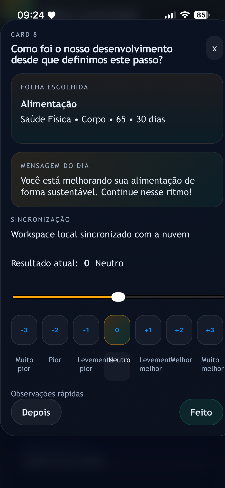<br>
      <em>mobile view</em>
    </td>
  </tr>
</table>

9.  Pergunta do proximo passo concreto com modal de busca das folhas ligado ao card 8.
10. Card oculto com botao `...` para mostrar folhas alteradas e historico de valores.
11. Organograma com o progresso das variaveis cardinais às cardinais.
<a href="public/docs/6organograma.png" align="center">
  <p align=center>
    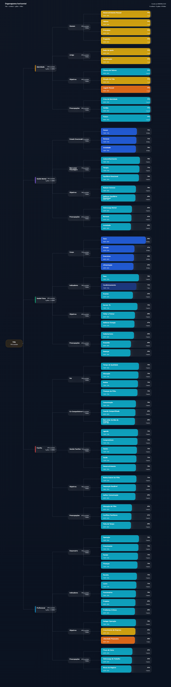<br>
    <em>downloaded from user exemple</em>
  </p>
</a>


### PWA

- `manifest.json`
- `sw.js`
- icones SVG
- registro automatico do service worker no navegador

### Persistencia local

- O estado da sessao e salvo por usuario no `localStorage`.
- O app lembra:
  - valores das cardinais
  - valores das folhas
  - pergunta semanal
  - proximo passo concreto
  - abertura do card oculto

### Persistencia remota

- O envio para o Firestore e automatico e continuo.
- O app sincroniza ao abrir, ao retomar foco, ao voltar da suspensao e depois das alteracoes locais.
- O botao `Salvar` continua como atalho opcional para forcar a sincronizacao.
- O workspace leva metadados de revisao para ajudar a resolver conflitos entre dispositivos.
- O `localStorage` e salvo automaticamente a cada alteracao.
- O primeiro conjunto de cardinais e folhas aparece localmente como seed do prototipo.

---

## Dados ja cadastrados no prototipo

### Variaveis cardinais

O prototipo tem por regra 5 variáveis cardinais:

- Identidade
- Saude Mental
- Saude Fisica
- Familia
- Profissional

### Estrutura da arvore

- Nivel 1: cards tronco
  - Identidade
  - Saude Mental
  - Saude Fisica
  - Familia
  - Profissional
- Nivel 2: cards internos (galhos) dentro de cada tronco
- Nivel 3: folhas com valor e prazo

Alterar uma folha altera automaticamente a media do tronco.
Alterar o tronco redistribui a mudanca entre as folhas daquele tronco.

### Variaveis base

O prototipo ja vem com 69 folhas de como sementes, dentre elas temos alguns exemplos:

- Sono consistente
- Meditacao curta
- Sessao de terapia
- Caminhada diaria
- Hidratacao
- Alimentação simples
- Tempo com meu filho
- Conversa de alinhamento
- Rotina da casa
- Foco profundo
- Priorizacao da semana
- Aprendizado direcionado
- Autoconhecimento
- Valores pessoais

### Onde o usuário pode renomear, inseir mais folha, removê-las ou ocultá-las do seu perfil

Como o protótipo ainda está em fase te testes, ainda não fomos capaz de implantar definições de gênero, logo, algumas folhas podem ter nomes masculinizados, a saída do usuário atulmanete, seria poder alterar o nome das folhas através de um botão sinalizado por um tipo de "lápiz" no canto direito do card da própria folha.
<table align="center">
  <tr>
    <td align="center">
      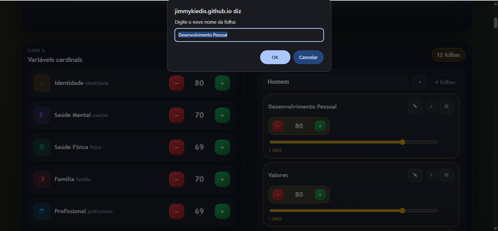<br>
      <em>desktop view</em>
    </td>
    <td align="center">
      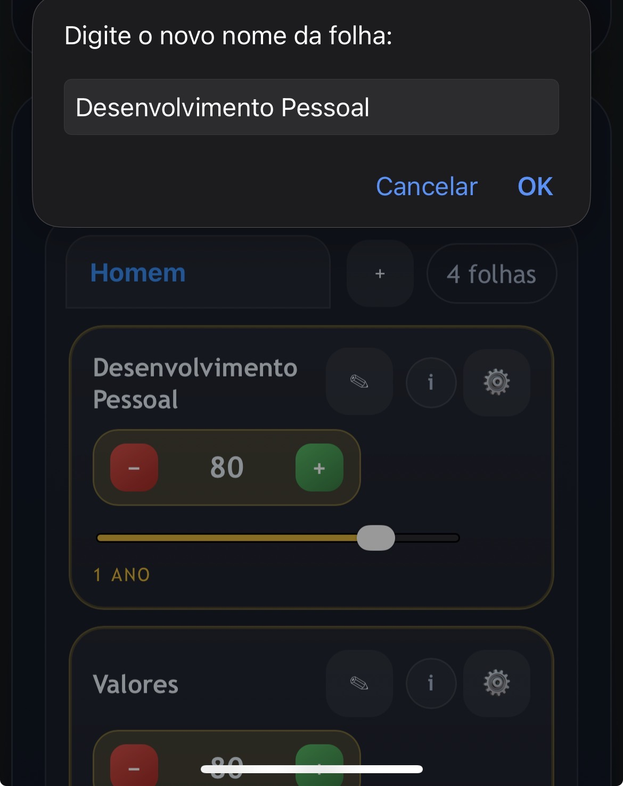<br>
      <em>mobile view</em>
    </td>
  </tr>
</table>

Quando o usuário propõe pra se que as folhas que vieram como semente no nosso sistema não atendem todas as areas da sua vida, ele pode usar o botõa `+` no canto direito direito do nó de nível 2 (galhos)
<table align="center">
  <tr>
    <td align="center">
      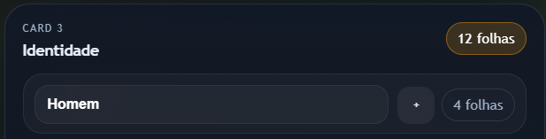<br>
      <em>desktop view</em>
    </td>
    <td align="center">
      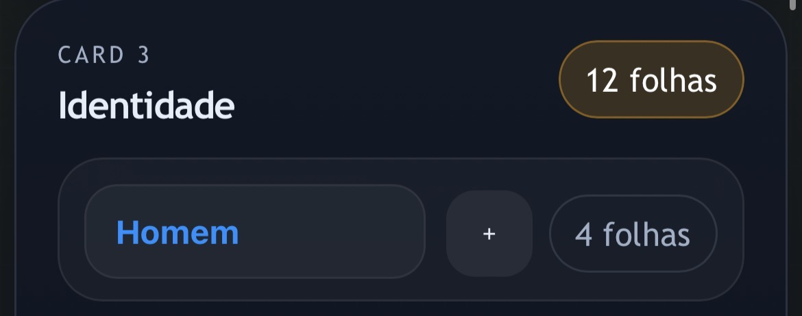<br>
      <em>mobile view</em>
    </td>
  </tr>
</table>

Para remover ou ocultar as folhas, inclusive as sementes base, é através de um botão de configuração localizado ao lado da mesma dentro do seu próprio card. Neste caso, revela-se os botões de "Excluir" e "Ocultar".
<table align="center">
  <tr>
    <td align="center">
      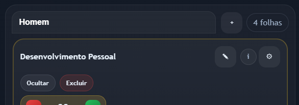<br>
      <em>desktop view</em>
    </td>
    <td align="center">
      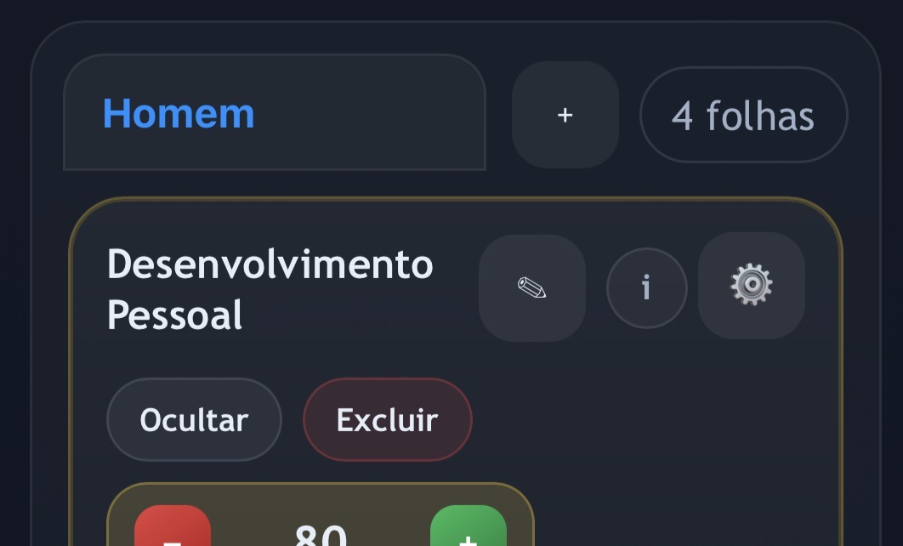<br>
      <em>mobile view</em>
    </td>
  </tr>
</table>


### (Desenvolvimento) Onde alterar cada folha do dashboard

Se um novo desenvolvedor quiser mudar o nome das sementes, a descricao ou o comportamento da delas (seja tronco, galhos ou folhas), estes sao os arquivos certos:

- `src/js/services/variableService.js`
  - define o seed das folhas no array `leafSeed`
  - aqui ficam os campos principais de cada folha:
    - `cardinalId`
    - `nodeId`
    - `nodeName`
    - `name`
    - `horizonDays`
    - `currentValue`
    - `targetValue`
    - `note`
    - `brothers`
  - se quiser trocar o nome exibido por padrao no dashboard, altere o `name`
  - se quiser trocar o texto-base da folha, altere `note`

- `src/js/ui/dashboard.js`
  - define o texto da ajuda contextual que aparece no `i` de cada folha
  - o mapa de apoio esta em `leafHelpExamples`
  - o modal que abre ao clicar no `i` esta em `renderLeafHelpModal`
  - se a descricao da folha mudar, atualize tambem esse arquivo para manter a ajuda coerente com o nome novo

- `src/assets/text/frases_dashboard.json`
  - guarda as mensagens motivacionais ligadas ao nome da folha
  - se a folha trocar de nome, vale revisar esse arquivo para manter as frases coerentes

Resumo pratico:

- `variableService.js` = onde a folha nasce e recebe nome/descricao base
- `dashboard.js` = onde a folha explica para o usuario o que significa
- `frases_dashboard.json` = onde ficam as mensagens de apoio associadas a ela

### Regras das folhas

- Valor entre `49` e `99`
- Prazo ou horizonte temporal
- Observação
- Relacao com cardinal
- Progresso calculado no card 10
- Revisão diária com status bar de `-3` a `+3` no pop-up do card 8

---

## (Desenvolvimento) Como iniciar o app

Use o servidor local incluido no projeto:

```bash
npm run dev
```

Depois abra:

```text
http://127.0.0.1:4173
```

Importante:

- Abra o app pela raiz do repositorio, usando `index.html`.
- Nao use mais `src/index.html`, porque ele foi removido.
- Os arquivos do PWA tambem vivem na raiz:
  - `manifest.json`
  - `sw.js`

---

## Provisionar usuario de acesso

Nao existe tela de criar conta. O usuario pode ser criado pelo backend usando o script de provisionamento.

### Script

```bash
npm run provision:user
```

### Variaveis necessarias

- `FIREBASE_EMAIL`
- `FIREBASE_PASSWORD`
- opcional: `FIREBASE_DISPLAY_NAME`

### Exemplo

```powershell
$env:FIREBASE_EMAIL="mail@mail.com"
$env:FIREBASE_PASSWORD="123456789"
npm run provision:user
```

### Importante

Se o Firebase retornar `CONFIGURATION_NOT_FOUND`, normalmente significa que o provedor `Email/Password` ainda nao esta habilitado no projeto.
Nesse caso:

1. Abra o Firebase Console.
2. Va em `Authentication`.
3. Ative o provedor `Email/Password`.
4. Salve.
5. Rode o script novamente.

---

## Guia rapido

### 1. Rodar localmente

1. Abra o terminal na raiz do projeto.
2. Execute `npm run dev`.
3. Acesse `http://127.0.0.1:4173`, ou outro endereço que o `npm run dev` retornar para você no terminal.

### 2. Entrar no app

1. Use um usuario com Authentication por e-mail e senha habilitado no Firebase.
2. Faca login na tela inicial.
3. O menu principal carrega com os dados de prototipo ja definidos.

### 3. Validar o prototipo

1. Ajuste uma cardinal no card 2.
2. Abra a pergunta semanal no card 8.
3. Use o card 9 para procurar uma folha.
4. Abra o card 10 pelo botao `...`.
5. Observe o card 11 com o grafico de progresso.

### 4. Subir para o Firestore

1. Faça as alterações desejadas.
2. Confirme que o estado foi salvo localmente.
3. Clique em `Salvar` no topo do menu principal.
4. Aguarde a confirmacao de envio para o Firestore.

---

## Estrutura atual

```text
sobrecarga/
├── index.html
├── manifest.json
├── sw.js
├── package.json
├── scripts/
│   └── dev-server.mjs
├── icons/
│   ├── icon-192.svg
│   └── icon-512.svg
├── src/
│   ├── css/
│   │   ├── variables.css
│   │   ├── layout.css
│   │   ├── components.css
│   │   └── app.css
│   └── js/
│       ├── app.js
│       ├── firebase/
│       │   └── firebase.js
│       ├── models/
│       │   ├── BaseVariable.js
│       │   ├── CardinalVariable.js
│       │   └── WeeklyReview.js
│       ├── services/
│       │   ├── adviceService.js
│       │   ├── moodService.js
│       │   ├── reviewService.js
│       │   └── variableService.js
│       ├── ui/
│       │   ├── adviceModal.js
│       │   ├── dashboard.js
│       │   ├── moodPanel.js
│       │   └── radarChart.js
│       └── utils/
│           ├── calculations.js
│           └── dates.js
├── firebase.json
└── readme.md
```

---

## Configuracao do Firebase

Hoje a configuracao do Firebase fica centralizada em `src/js/firebase/firebaseConfig.js`.

Isso evita divergencias entre `localhost`, GitHub Pages e scripts locais, porque a mesma origem de verdade alimenta o app e os utilitarios do projeto.

### O que precisa existir no Firebase

- Authentication com login por e-mail e senha habilitado
- Projeto Firebase ativo
- Usuario cadastrado para teste

### Atencao

Se o login falhar, normalmente o problema e um destes:

- e-mail ou senha invalidos
- Authentication nao habilitado
- usuario ainda nao criado no Firebase Console

---

## O que ainda falta fazer

### Prioridade alta

- Criar uma tela de "primeiro login" com perguntas para se obter o estado atual do usuário, e poder pré-estabelecer valores na hora de criar as sementes.
- Criar sistema de gênero, e modo de tratamento.
- Criar tela própria para cadastro e edicao real de folhas.
- Criar tela própria para cadastro e edicao real de cardinais.

### Prioridade media

- Melhorar a busca do modal de folhas com filtros mais uteis.
- Novos cards com informações mais relevantes.
- Perfil de usário com foto, nome de usuário e possibilidade de trocar senha.
- Popular `frases_dashboard.json` com pelo menos 15 conselhos para cada variável base.

### Prioridade futura

- Tela dinâmica de acordo com o progresso e "passo concreto".
- Backup e exportacao via JSON, CSV ou mesmo BIN.
- Historico grafico mais completos completo.
- Conselhos ganham novos parametros e são escolhidas de acordo com o quantidade de pontos que a variável atualmente tem.

---

## Observacoes importantes

- O app ja esta com foco em mobile e desktop.
- O card 10 e 11 fica oculto e pode ser aberto pelo botao `...`.
- O radar chart é desenhado em SVG, sem dependência externa.
- O projeto esta estruturado como PWA, mas ainda esta no estagio de prototipo funcional.

---

## Checklist para continuar o projeto

### Antes de mexer em dados reais

- Confirmar que o login do Firebase esta funcionando.
- Criar ao menos um usuario de teste.
- Validar se o `localStorage` atual atende o fluxo de prototipo.

### Antes de conectar o Firestore

- Verificar os dados definidos e o formato das colecoes.
- Verificar como ficam cardinais, folhas e revisoes semanais.
